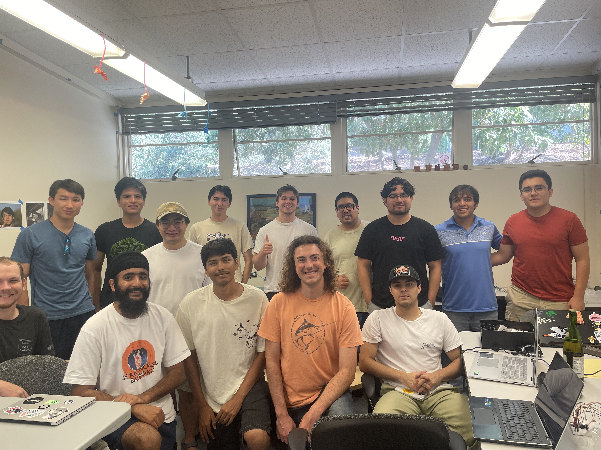
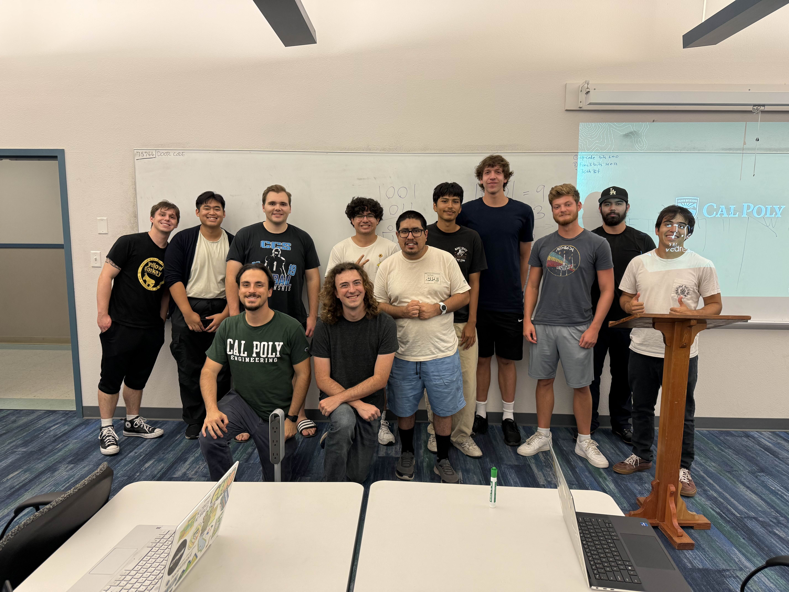
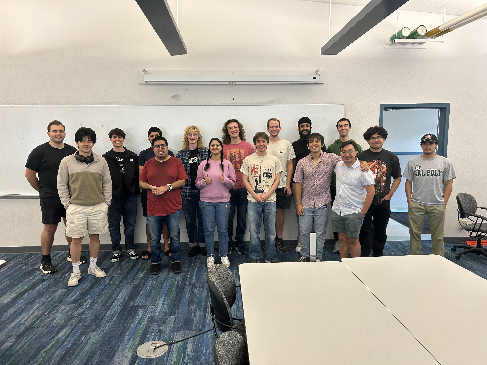
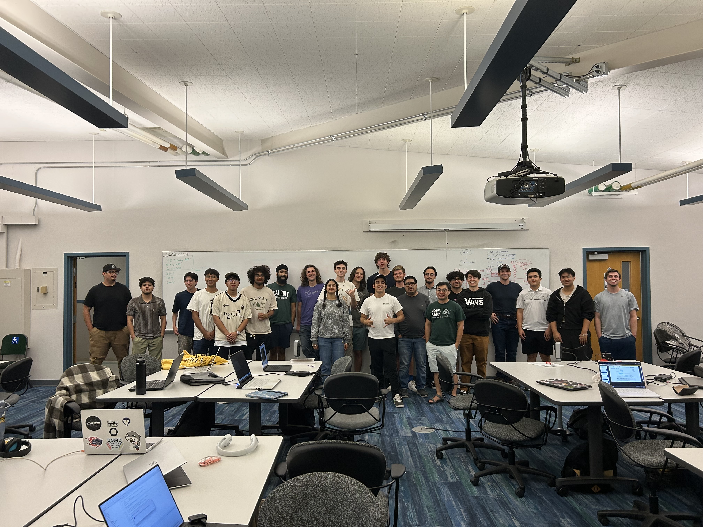

.. raw:: html

   

====================
CARP Contributor Homepage
====================
.. raw:: html
   

.. toctree::
  :hidden:
  :maxdepth: 2
  :caption: Home

  self

.. toctree::
  :hidden:
  :maxdepth: 3
  :caption: Project Outline

  proj-info
  docs/risc-v/carp-opcodes

.. toctree::
  :hidden:
  :maxdepth: 3
  :caption: Taskboard

  tasks

.. toctree::
  :hidden:
  :maxdepth: 4
  :caption: Resources and Guides

  docs/video-guides/video-guides
  docs/asic-tools-installation/asic-tools
  docs/asic-tools-installation/visual-setup
  docs/flow-guides/index
  docs/asic-class/asic-class
  docs/FreeRTOS/index
  docs/memory/index
  docs/risc-v/index

.. toctree::
  :hidden:
  :maxdepth: 3
  :caption: Fall Schedule

  schedule

.. toctree::
  :hidden:
  :maxdepth: 3
  :caption: Meetings

  meetings/meeting-1
  meetings/meeting-2
  meetings/meeting-3
  meetings/meeting-4
  meetings/meeting-5

.. meta::
  :description: CARP Documentation Site
  :keywords: CARP, RISC-V, SystemVerilog

.. raw:: html

   

Welcome to the Cal Poly Computer Architecture Research Project (CARP) contributor homepage.

Here you will find the project outline, documentation, schedule, meeting info, and tasks.

.. raw:: html

   

|carp1| |carp2|
|carp3| |carp4|

.. raw:: html

   

  CARP Meeting 1 - 4

.. raw:: html

   

.. raw:: html

   

Discord
~~~~~~~
`CARP Discord Server <https://discord.gg/hg3czYUJB2>`_

Project Outline and Design
~~~~~~~~~~~~~~~
:doc:`proj-info`

ASIC-Tools Installation Guide
~~~~~~~~~~~~~~~~~~~~~~~~~~~~~~
:doc:`docs/asic-tools-installation/asic-tools`

Meetings
~~~~~~~~
:doc:`/meetings/meeting-1`

:doc:`meetings/meeting-2`

:doc:`meetings/meeting-3`

:doc:`meetings/meeting-4`

:doc:`meetings/meeting-5`

.. important:: The 5th meeting will be 10/4/2025 @ 12:00 PM in Bldg. 20, Room 100

.. raw:: html

   <h1>Schedule</h1>
   <iframe src="https://calendar.google.com/calendar/embed?src=49700e0209179c4d565157ceba4f7f0be256dff9aa0c7615eb68c1cbf6eb2269%40group.calendar.google.com&ctz=America%2FLos_Angeles" style="border: 0" width="800" height="600" frameborder="0" scrolling="no"></iframe>

Taskboard
~~~~~~~~~
:doc:`tasks`

.. raw:: html
